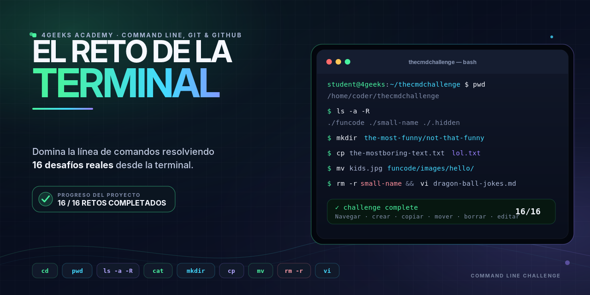

# El reto de la terminal

Resolución del proyecto **Command Line Challenge** del bootcamp de 4Geeks Academy
(módulo *Command Line, Git & GitHub*).

El reto consiste en 16 ejercicios sobre la carpeta `thecmdchallenge/` que obligan a
navegar, crear, copiar, mover, borrar y editar ficheros usando únicamente la terminal.

## Ejercicios y comandos utilizados

| # | Ejercicio | Comando |
|---|-----------|---------|
| 1 | Entrar en `thecmdchallenge/` | `cd` |
| 2 | *(sin comando)* | — |
| 3 | Mostrar la ruta actual | `pwd` |
| 4 | Listar ficheros incluidos los ocultos | `ls -a` |
| 5 | Listar el árbol completo | `ls -R` |
| 6 | Limpiar la pantalla | `clear` |
| 7 | Bajar a lo más hondo de `small-name` y leer `trophy.txt` | `cd`, `cat` |
| 8 | Volver a `funcode` y listar los JavaScript | `cd ..`, `ls *.js` |
| 9 | Crear `funcode/the-most-funny/not-that-funny` | `mkdir` |
| 10 | Copiar `the-mostboring-text.txt` como `lol.txt` | `cp` |
| 11 | Mover `kids.jpg` a `funcode/images/hello/` | `mv` |
| 12 | Eliminar la carpeta `small-name` | `rm -r` |
| 13 | Mostrar `the-ultimate-joke.txt` | `cat` |
| 14 | Vaciar `boringfolder` | `rm -r boringfolder/*` |
| 15 | Abrir `dragon-ball-jokes.md` con vi | `vi` |
| 16 | Borrar el primer chiste y guardar | `dd`, `:wq` |

## Notas

- La carpeta `not-that-funny` (ejercicio 9) no aparece en GitHub porque está vacía:
  Git versiona ficheros, no carpetas.
- `boringfolder` desaparece del repositorio por el mismo motivo tras vaciarla.
- Al hacer commit hay que usar `git add -A` en lugar de `git add .`, para que Git
  registre también los ficheros eliminados.

## Comandos aprendidos

`pwd` · `cd` · `ls -a -R` · `clear` · `cat` · `head` · `mkdir` · `cp` · `mv` · `rm -r` · `vi`

---

Proyecto original de [4Geeks Academy](https://4geeksacademy.com):
[breatheco-de/exercise-terminal-challenge](https://github.com/breatheco-de/exercise-terminal-challenge)
